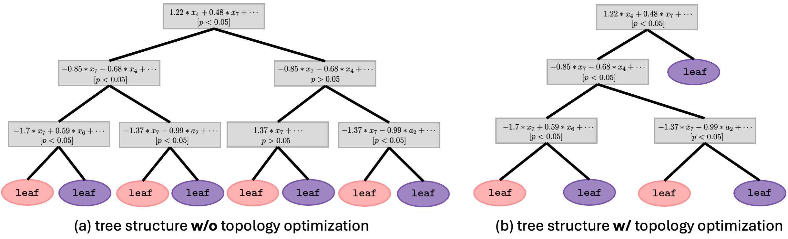
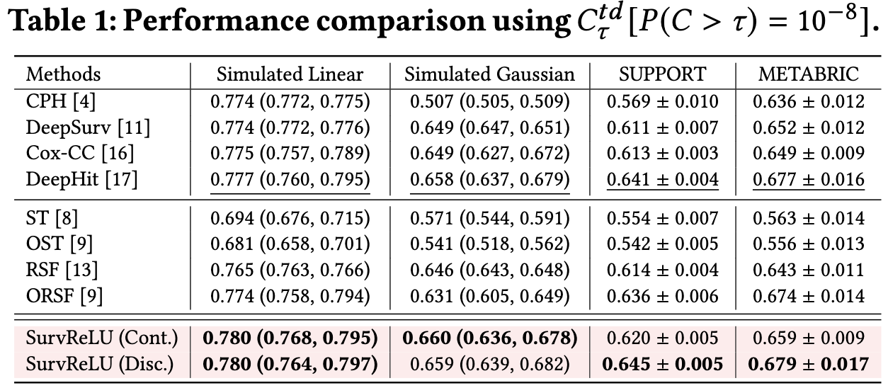
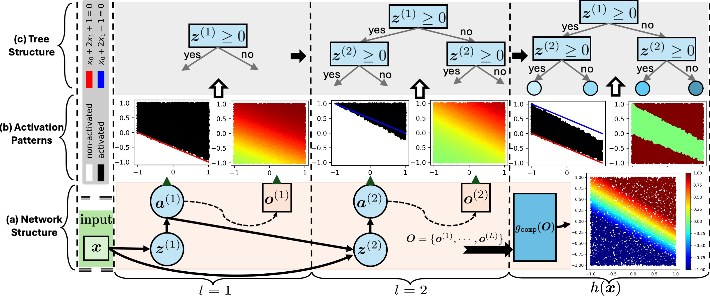

# [CIKM '24] SurvReLU
This repository contains official implementation for the paper titled "SurvReLU: Inherently Interpretable Survival Analysis via Deep ReLU Networks" 
[]()

## News :fire:
- **July 16, 2024:** Congratulations ! Paper has been accepted by 33rd ACM International Conference on
Information and Knowledge Management (CIKM 2024) !




> **Abstract.** 
Survival analysis models time-to-event distributions with censorship. Recently, deep survival models using neural networks have dominated due to their representational power and state-of-the-art performance. However, their "black-box" nature hinders interpretability, which is crucial in real-world applications. In contrast, "white-box" tree-based survival models offer better interpretability but struggle to converge to global optima due to greedy expansion. In this paper, we bridge the gap between previous deep survival models and traditional tree-based survival models through deep rectified linear unit (ReLU) networks. We show that a deliberately constructed deep ReLU network (SurvReLU) can harness the interpretability of tree-based structures with the representational power of deep survival models. 
Empirical studies on both simulated and real survival benchmark datasets show the effectiveness of the proposed SurvReLU in terms of performance and interoperability.

> **Network Architecture**  



# Usage
## 1. Prepare dataset
## 2. Dependencies
## 3. Train From Scratch

## Acknowledgements

This code is built on the top of [pycox](https://github.com/havakv/pycox) and [locally constant network](https://github.com/guanghelee/iclr20-locally-constant-nets), we thank their efficient and neat codebase. 

## Citation
If you find our work is useful in your research, please consider raising a star  :star:  and citing:

```

```
